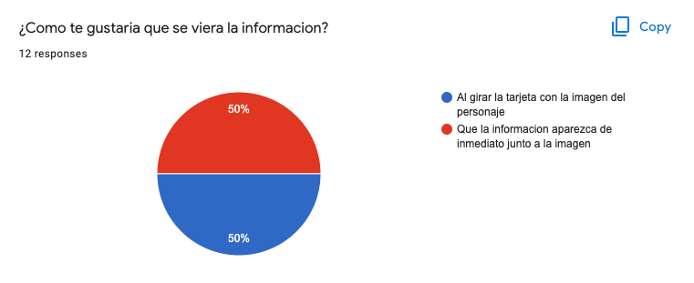
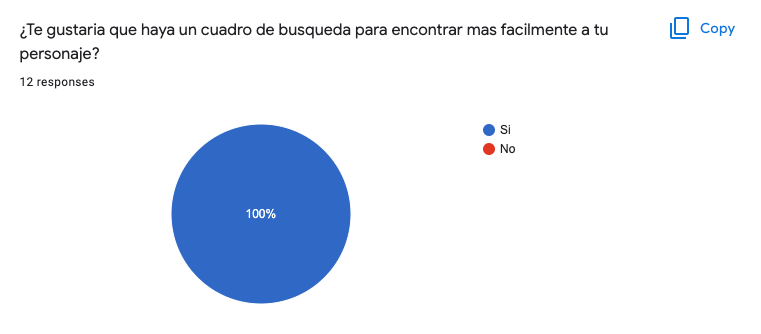

# Data Lovers

## Índice

* [1. Introduccion](#1-introduccion)
* [2. UX Design](#2-ux-design)
* [3. Nuestra Planning](#3-nuestra-planning)

***

## 1. Introduccion
Nuestra proyecto tiene como intencion informar a los usuarios de Rick y Morty, sobre la gran mayoria de personajes que aparecen en la series. 
Veremos data relacionada a si el personajes esta vivo o muerto (status), cual es su origen y a que especie pertenece.

Tambien agregamos unos extras como un link que los redirigira a una plataforma para ver la serie, a la pagina de Merch y al juego oficial de Rick y Morty. 

## 2. UX Design
Estos son los resultados de la encuesta que relalizamos con el fin de saber que cosas y de que modo les gustaria a nuestro usuarios ver en nuestra pagina.

Implementamos todo en nuestro proyecto en base a estos resultados. 

Este es nuesto prototipo de media. Todavia resolviendo unos detalles de la primera vista del usuario pero ya teniamos claro como se veria nuestra data. ç

## 3. Nuestra Planning
Basamos nuestra planificacion en las historias de usuario que sacamos de nuestra encuesta. Fuimos desglozando de a poco los criterios de acpetacion y las definiciones de terminado. 

Nos organizamos con 3 historias de usuario, que fuimos iterando a medida que avanzamos con el proyecto. 

